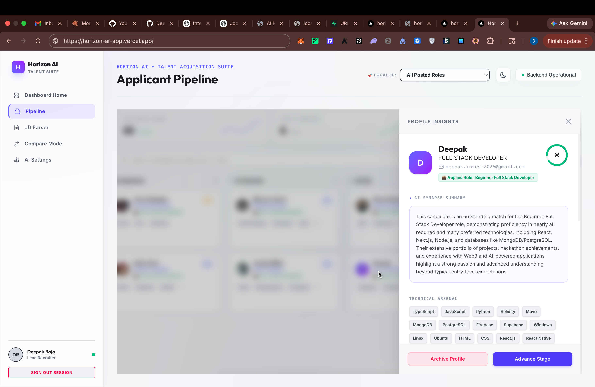
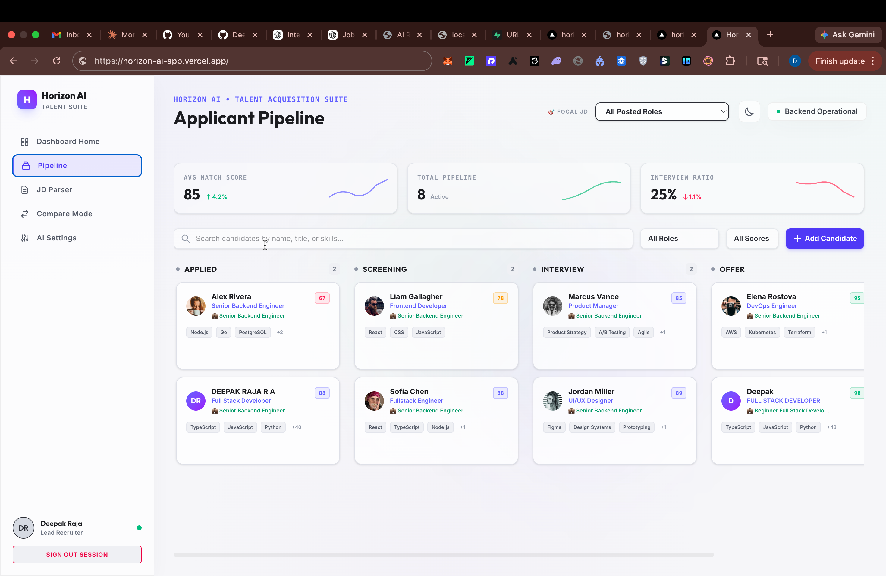
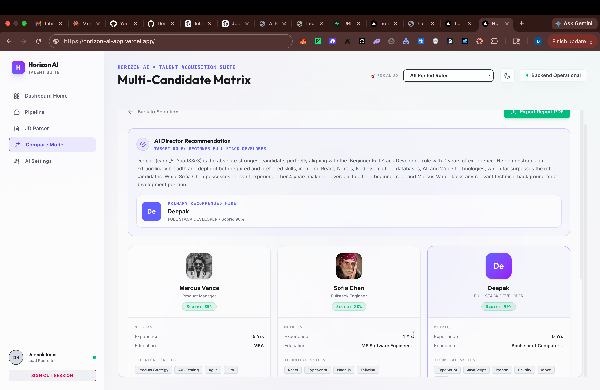
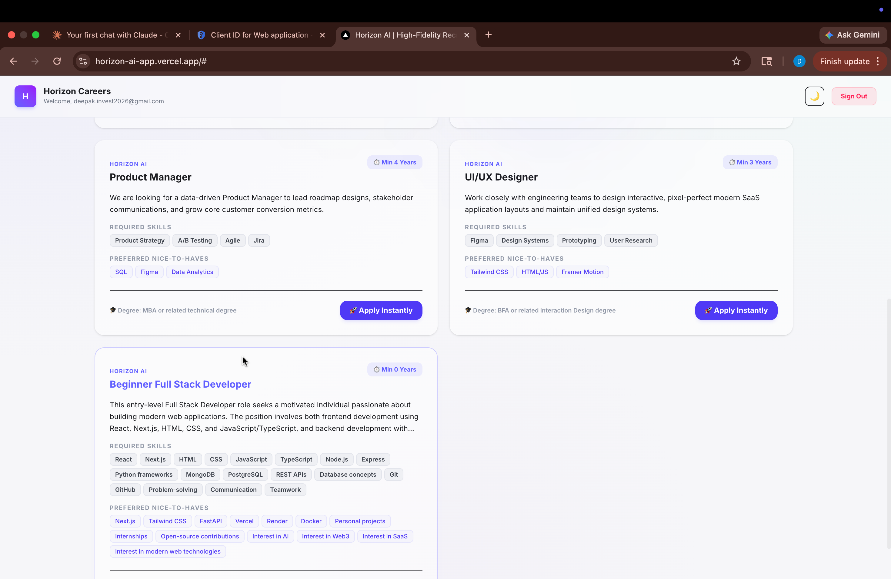
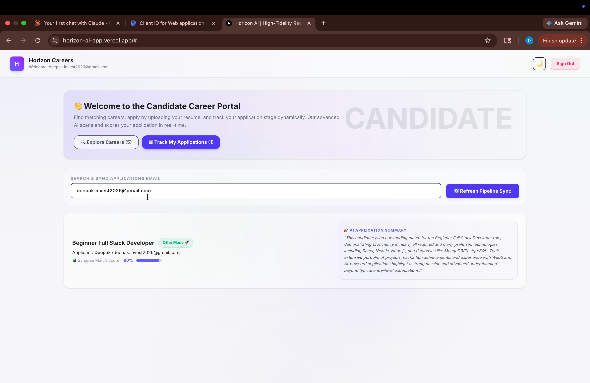

# Horizon AI — Next.js React 19 Frontend Client

This is the high-fidelity, premium client application for **Horizon AI** built using **Next.js** (App Router) and **React 19**. The interface features curated CSS design tokens, smooth micro-interactions, responsive Kanban pipelines, and side-by-side executive candidate comparison systems with pristine print-bleed layouts.

---

## 🎨 Premium UX & Design Elements

*   **Elite Graphite Dark Theme**: Built around deep graphite hues, soft glowing border grids, and luxurious glassmorphism blurs for an executive dashboard feel.
*   **Kanban Telemetry Pipeline**: Interactive state tracking that allows drag-and-drop-style status transitions with on-the-fly REST integrations.
*   **Pristine Print-Bleed layouts**: Custom CSS media queries configured to strip sidebar telemetry, margins, and dashboard headers instantly when executing browser prints, rendering pixel-perfect, monochrome evaluation reports.
*   **Responsive Telemetry**: Completely adaptive layout blocks optimized for widescreen executive screens down to career portal interfaces on mobile devices.

---

## 📸 Product Tour & Telemetry Showcase

Here is a visual walk-through of the premium, high-fidelity interfaces running live on **Horizon AI**:

### 1. Executive Telemetry Dashboard (Applicants Overview)
The primary analytical interface presenting system stats, database connectivity telemetry, candidate applications, and active talent profiles:


### 2. Interactive Kanban Telemetry Pipeline
Manage and transition candidates dynamically across hiring stages with real-time state synchronization:


### 3. Hiring Committee Candidate Compare Matrix
Compare multiple candidates side-by-side against custom role requirements. Trigger an automated Hiring Committee evaluation and generate monochrome print-bleed executive reports:


### 4. Careers & Job Listings View (Candidate Portal)
The career board where job seekers can view active opportunities and upload resumes:


### 5. Live Candidate Application Tracking
The telemetry board allowing applicants to monitor their application review status and stage logs in real-time:


### 🎬 Workflow Demonstration Video
Watch our high-fidelity workspace demonstration video to see the full resume-parsing, matching, and committee evaluation flow in action:
*   🎥 **[Watch the High-Fidelity Workspace Video Demo (Google Drive)](https://drive.google.com/file/d/1dgyjOxtX7f-Yu5i4rTx5_qADaS7mLGAQ/view?usp=sharing)**


---

## 🔐 Authentication Modes

The frontend client operates on a smart segmented authentication architecture:
1.  **Cloud Supabase Auth (Production)**: Handles secure JWT logins, passwordless Google OAuth handshakes, and persistent session recovery directly on our live domain.
2.  **Sandbox Local Simulation**: Automatically initializes a Mock Recruiter workspace (`lead.recruiter@horizon.ai`) if Supabase environment keys are missing, allowing developers to test the full matching pipeline without registering accounts!

---

## 📋 Environment Configuration

Create a `.env` file in this directory with the following variables:
```env
# URL base pointing to your live FastAPI backend server
NEXT_PUBLIC_API_URL=https://horizon-ai-backend.vercel.app

# Supabase Auth configuration (Optional: Sandbox mock active if left empty)
NEXT_PUBLIC_SUPABASE_URL=https://clwtylsgsktgzxfzozez.supabase.co
NEXT_PUBLIC_SUPABASE_ANON_KEY=eyJhbGciOiJIUzI1NiIsInR5cCI6IkpXVCJ9...
```

---

## 🚀 Local Installation & Launch

Ensure you have Node.js (v18+) and your preferred package manager (`bun`, `npm`, or `yarn`) installed.

```bash
# 1. Install required dependencies
bun install   # or npm install

# 2. Spin up the hot-reloading Next.js development server
bun run dev   # or npm run dev
```
*Browse to `http://localhost:3000` to interact with the recruitment telemetry dashboard!*

---

## 🛡️ Production Security Header Maps (`vercel.json`)
The frontend contains an optimized `vercel.json` config mapping custom headers to enforce the following security frameworks:
*   `X-Frame-Options: DENY` (Anti-Clickjacking protection)
*   `X-Content-Type-Options: nosniff` (Forced browser MIME-type validation)
*   `X-XSS-Protection: 1; mode=block` (Browser-level script blocking)
*   `Referrer-Policy: strict-origin-when-cross-origin` (Strict outbound referrers)
